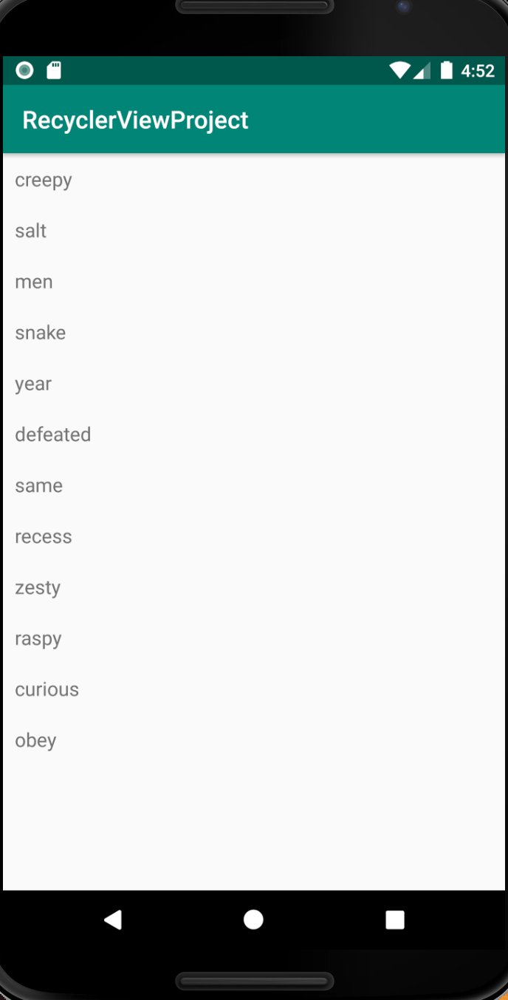

# Recycler View Project
This is an Android project about demonstrating the Recycler view, a new flexible view that
provides a simple way of viewing large data sets with ease.

## Screenshots

## Getting Started 
These instructions will get you a copy of the project up and running on your local machine for
development and testing purposes. See deployment for notes on how to deploy the project on a live system.

### Prerequisites
These are the things you need to install the software and how to install them
- Android studio
- JDK installed
- Fast Machine

### Installing
Follow these simple steps to get you started;
- Open Android studio
- `git clone https://github.com/NabunyaLilian/RecyclerViewProject.git`
- `git checkout recyclerview-project-v1`
- Run App

## Built With
- Android/Java

## Versioning
This is the first version

